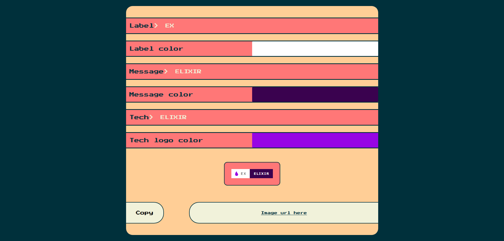
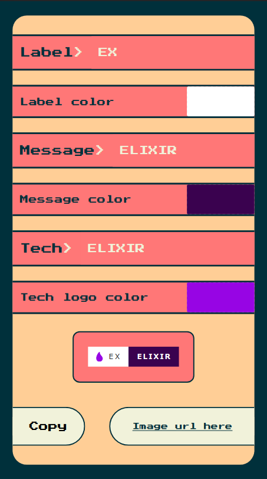

  
  
  

  <h1>😎BADGE GENERATOR😎</h1>

You can use this to create the badges and preview it in real time.

A badge is an image that you can use in your readme to show tech that you're using or other things too.

